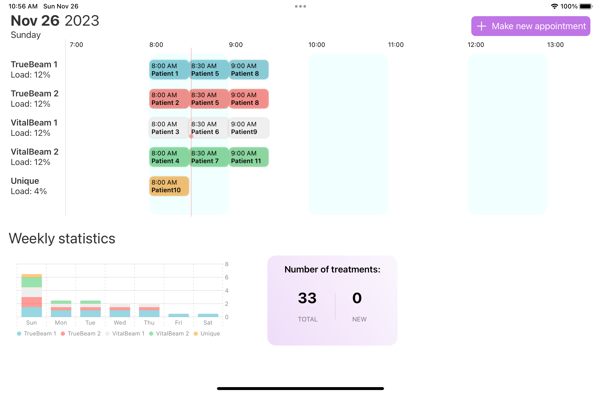

# SwiftCare ✨

## Overview
This App automates radiation therapy scheduling with a First-Come First-Served (FCFS) algorithm, matching cancer types with suitable machines and assigning appointments based on selected fraction options. It provides a user-friendly Swift-powered interface ensuring a modern, performant experience.

## Problem it Solves

Forget about the old-school, time-consuming way of manually picking machines and juggling appointments. The app automates all that, making sure each patient gets the right treatment on time while keeping things simple for the doctors.

## Real-World Impact

In the real world, the app means less waiting for patients and less stress for doctors. By automating the nitty-gritty of scheduling freeing up time for healthcare providers to focus on what really matters – taking care of patients. This isn't just about tech; it's about making the treatment journey smoother for everyone involved.